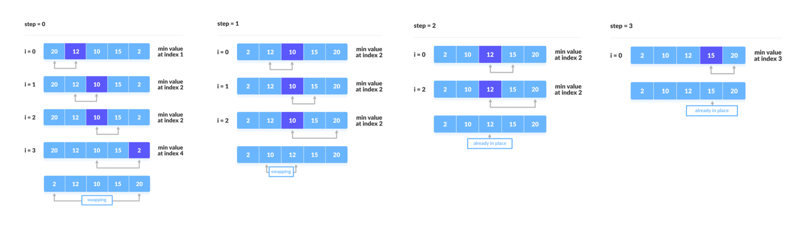

# Klassiker

Implementation of data structures using C language. What in the world is more classic than this?

# Table of Contents
- [Why Learn DSA?](#question)
- [Types of Data Structure](#types)
- [Asymptotic Analysis](#asymp)
- [Stack](#stack)
- [Queue](#queue)
- [Linked List](#linked-list)
- [Hash Table](#has-table)
- [Sort Algorithms](#sorts)
- [Search Algorithms](#searches)
- [Graph](#graph)

## Why Learn DSA?

- Write optimized and scalable code - Once you have knowledge about different data structures and algorithms, you can determine which data structure and algorithm to choose in various conditions.
- Effective use of time and memory - Having knowledge about data structures and algorithms will help you write codes that run faster and require less storage.
- Better job opportunities - Data structures and algorithms questions are frequently asked in job interviews of various organizations including Google, Facebook, and so on.

## Types of Data Structure

| Linear data structure      | Non-linear data structure |
| ----------- | ----------- |
| The data items are arranged in sequential order, one after the other.      | The data items are arranged in non-sequential order (hierarchical manner).       |
| All the items are present on the single layer.   | The data items are present at different layers.        |
| It can be traversed on a single run. That is, if we start from the first element, we can traverse all the elements sequentially in a single pass.   | It requires multiple runs. That is, if we start from the first element it might not be possible to traverse all the elements in a single pass.        |
| The memory utilization is not efficient.   | Different structures utilize memory in different efficient ways depending on the need.        |
| The time complexity increase with the data size.   | Time complexity remains the same.        |
| Example: Arrays, Stack, Queue, Linked List   | Example: Tree, Graph        |

## Asymptotic Analysis

The efficiency of an algorithm depends on the amount of time complexity and storage complexity of the algorithm.

An algorithm may not have the same performance for different types of inputs. With the increase in the input size, the performance will change.

The study of change in performance of the algorithm with the change in the order of the input size is defined as asymptotic analysis.

### Asymptotic Notations

Asymptotic notations are the mathematical notations used to describe the running time of an algorithm when the input tends towards a particular value or a limiting value.

There are mainly three asymptotic notations:

- O notation: Big-O notation represents the upper bound of the running time of an algorithm. Thus, it gives the worst-case complexity of an algorithm. (a)
- Ω notation: Omega notation represents the lower bound of the running time of an algorithm. Thus, it provides the best case complexity of an algorithm. (b)
- Θ notation: Theta notation encloses the function from above and below. Since it represents the upper and the lower bound of the running time of an algorithm, it is used for analyzing the average-case complexity of an algorithm. (c)

### Comparing Time Complexity

1 < logn < sqrtn < n < nlogn < n^2 < n^3 < 2^n < 3^n < n^n

## Stack
A stack is a linear data structure that follows the principle of Last In First Out (LIFO). This means the last element inserted inside the stack is removed first. You can think of the stack data structure as the pile of plates on top of another.

See the code [here](./code/Stack%20&%20Queue/Stack.c)

### Stack Time Complexity

For the array-based implementation of a stack, the push and pop operations take constant time, i.e. O(1).

### Applications of Stack Data Structure

- To reverse a word - Put all the letters in a stack and pop them out. Because of the LIFO order of stack, you will get the letters in reverse order.
- In compilers - Compilers use the stack to calculate the value of expressions like 2 + 4 / 5 * (7 - 9) by converting the expression to prefix or postfix form.
- In browsers - The back button in a browser saves all the URLs you have visited previously in a stack. Each time you visit a new page, it is added on top of the stack. When you press the back button, the current URL is removed from the stack, and the previous URL is accessed.

## Queue
A Queue is a linear data structure that follows the principle of First In First Out (FIFO). This means the first element inserted inside the stack is removed first. You can think of the stack data structure as the ticket queue outside a cinema hall, where the first person entering the queue is the first person who gets the ticket.

See the code [here](./code/Stack%20&%20Queue/Queue.c)

### Queue Time Complexity

For the array-based implementation of a queue, the enqueue and dequeue operations take constant time, i.e. O(1).

### Applications of Queue Data Structure

- CPU scheduling, Disk Scheduling
- When data is transferred asynchronously between two processes.The queue is used for synchronization. For example: IO Buffers, pipes, file IO, etc
- Handling of interrupts in real-time systems.
- Call Center phone systems use Queues to hold people calling them in order.

## Linked list
A linked list is a linear data structure that includes a series of connected nodes. A node in a linked list typically consists of two components:
- Data: It holds the actual value or data associated with the node.
- Next Pointer: It stores the memory address (reference) of the next node in the sequence.

Head and Tail: The linked list is accessed through the head node, which points to the first node in the list. The last node in the list points to NULL or nullptr, indicating the end of the list. This node is known as the tail node.

### Array vs Linked List

| Array | Linked List |
| ----------- | ----------- |
| Arrays are stored in contiguous location | Linked lists are not stored in contiguous location. |
| Fixed in size. | Dynamic in size. |
| Memory is allocated at compile time. | Memory is allocated at run time. |
| Uses less memory than linked lists. |  Uses more memory because it stores both data and the address of next node. |
|  Elements can be accessed easily. | Element accessing requires the traversal of whole linked list. |
| Insertion and deletion operation takes time. | Insertion and deletion operation is faster. |

### Types of linked lists
- Single-linked list: In a singly linked list, each node contains a reference to the next node in the sequence. Traversing a singly linked list is done in a forward direction.
- Double linked list: In a doubly linked list, each node contains references to both the next and previous nodes. This allows for traversal in both forward and backward directions, but it requires additional memory for the backward reference.
- Circular linked list:  In a circular linked list, the last node points back to the head node, creating a circular structure. It can be either singly or doubly linked.
  
Simple linked list implementation [->](./code/Linked%20List%20&%20Hash%20Table/Linked-List.c)

Linked list implementation with operations [->](./code/Linked%20List%20&%20Hash%20Table/Operation-Linked-List.c)

### Linked List Time Complexity
|  | Array | Linked List |
| ----------- | ----------- | ----------- |
| Cost of accessing elements | O(1) | O(n) |
| Insert/Remove from beginning | O(n) | O(1) |
| Insert/Remove from end | O(1) | O(n) |
| Insert/Remove from mid | O(n) | O(n) |

### Applications of Linked List
- Dynamic memory allocation
- Implemented in stack and queue
- In undo functionality of softwares
- Hash tables, Graphs

## Hash Table
The Hash table data structure stores elements in key-value pairs where:

- Key- unique integer that is used for indexing the values
- Value - data that are associated with keys.

Hash tables are named Object in JavaScript, Dictionary in Python, and Map in Java, Scala, and Go.

Hashing (Hash Function): In a hash table, a new index is processed using the keys. And, the element corresponding to that key is stored in the index. This process is called hashing.

Hash Collision: When the hash function generates the same index for multiple keys, there will be a conflict (what value to be stored in that index). This is called a hash collision.

See the code [here](./code/Linked%20List%20&%20Hash%20Table/Hash-Table.c)

### Applications of Linked List
Hash tables are implemented where
- constant time lookup and insertion is required
- cryptographic applications
- indexing data is required

## Sort Algorithms

### Bubble Sort
Bubble Sort is the simplest sorting algorithm that works by repeatedly swapping the adjacent elements if they are in the wrong order. This algorithm is not suitable for large data sets as its average and worst-case time complexity is quite high. Just like the movement of air bubbles in the water that rise up to the surface, each element of the array move to the end in each iteration. Therefore, it is called a bubble sort.

See the code [here](./code/Sorts/Bubble-Sort.c)

### Selection Sort
The algorithm repeatedly selects the smallest (or largest) element from the unsorted portion of the list and swaps it with the first element of the unsorted part. This process is repeated for the remaining unsorted portion until the entire list is sorted. 

See the code [here](./code/Sorts/Selection-Sort.c)

### Insertion Sort
Insertion sort is a simple sorting algorithm that works similar to the way you sort playing cards in your hands. The array is virtually split into a sorted and an unsorted part. Values from the unsorted part are picked and placed at the correct position in the sorted part.

See the code [here](./code/Sorts/Insertion-Sort.c)

### Merge Sort
Merge Sort is one of the most popular sorting algorithms that is based on the principle of Divide and Conquer Algorithm. Here, a problem is divided into multiple sub-problems. Each sub-problem is solved individually. Finally, sub-problems are combined to form the final solution.
See the code [here](./code/Sorts/Merge-Sort.c)

### Quick Sort
QuickSort is a sorting algorithm based on the Divide and Conquer algorithm that picks an element as a pivot and partitions the given array around the picked pivot by placing the pivot in its correct position in the sorted array.
See the code [here](./code/Sorts/Quick-Sort.c)

### Sorts Complexity Comparison
| Algorithms | Best Case | Average Case | Worst Case| Memory |
| ----------- | ----------- | ----------- | ----------- | -----------|
| Buuble Sort | n | n^2 | n^2 | 1 |
| Selection Sort | n^2 | n^2 | n^2 | 1 |
| Insertion Sort | n | n^2 | n^2 | 1 |
| Merge Sort | nlogn | nlogn | nlogn | n |
| Quick Sort | nlogn | nlogn | n^2 | nlogn |

## Search Algorithms

### Linear Search
Linear search is a sequential searching algorithm where we start from one end and check every element of the list until the desired element is found. It is the simplest searching algorithm.

See the code [here](./code/Searches/Linear-Search.c)

### Binary Search
Binary Search is a searching algorithm for finding an element's position in a sorted array. In this approach, the element is always searched in the middle of a portion of an array.

See the code [here](./code/Searches/Binary-Search.c)

### Linear Search vs Binary Search

## Tree
A tree is a non-linear hierarchical data structure that consists of nodes connected by edges such that there exists exactly one path between any two nodes.

### Tree Terminologies
- Node: A node is an entity that contains a key or value and pointers to its child nodes.
- Root: It is the topmost node of a tree.
- Leaf: The last nodes of each path.(do not contain a link/pointer to child nodes.)
- Edge: It is the link between any two nodes.
- Height of a Node: The number of edges from the node to the deepest leaf.
- Depth of a Node: The number of edges from the root to the node.
- Height of a Tree: The height of the root node.

### Why Tree Data Structure?
Other data structures such as arrays, linked list, stack, and queue are linear data structures that store data sequentially. In order to perform any operation in a linear data structure, the time complexity increases with the increase in the data size. But, it is not acceptable in today's computational world.

Different tree data structures allow quicker and easier access to the data as it is a non-linear data structure.

## Graph
A Graph is a non-linear data structure that consists of vertices connected by edges. More formally a Graph is composed of a set of vertices( V ) and a set of edges( E ). The graph is denoted by G(E, V).

### Difference Between Tree and Graph

- Graphs do not have a root node.
- Graphs can have more than one path between vertices, so they can have loops.
- Graphs have two traversal techniques namely, breadth−first search and depth−first search, but Trees have three traversal techniques namely, pre−order, in−order, and post−order.

### Graph Applications
Graphs are used to solve many real-life problems. Graphs are used to represent networks. The networks may include paths in a city or telephone network or circuit network. Graphs are also used in social networks. For example facebook uses a graph data structure to store its data. In Facebook, each person is represented with a vertex(or node). Each node is a structure and contains information like person id, name, gender, locale etc. Every relationship is an edge from one node to another. Whether you post a photo, join a group, like a page, etc., a new edge is created for that relationship.

## Spanning Tree

A spanning tree is a sub-graph of an <u>undirected</u> <u>connected</u> graph, which includes all the vertices of the graph with a minimum possible number of edges. 

An undirected graph is a graph in which the edges do not point in any direction (ie. the edges are bidirectional).

A connected graph is a graph in which there is always a path from a vertex to any other vertex.